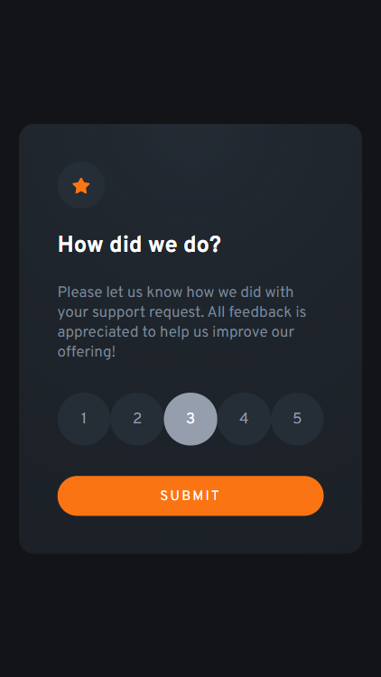
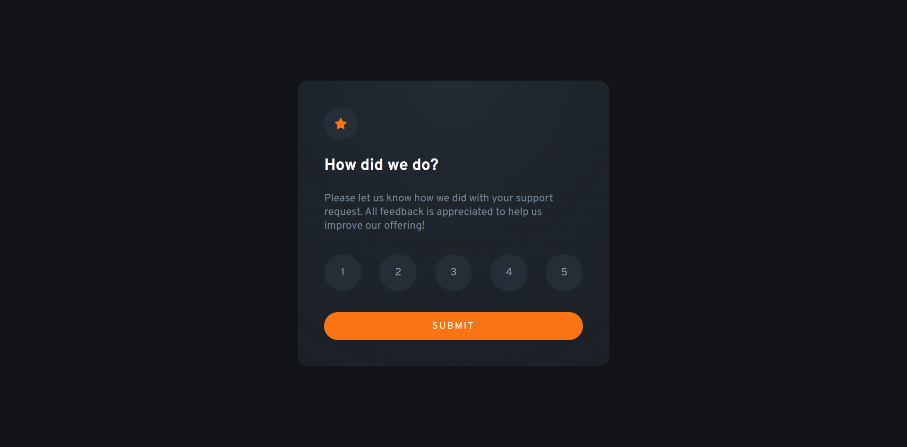
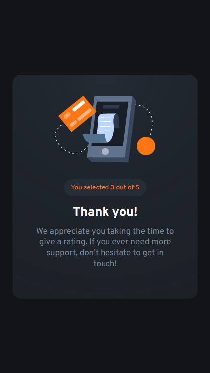
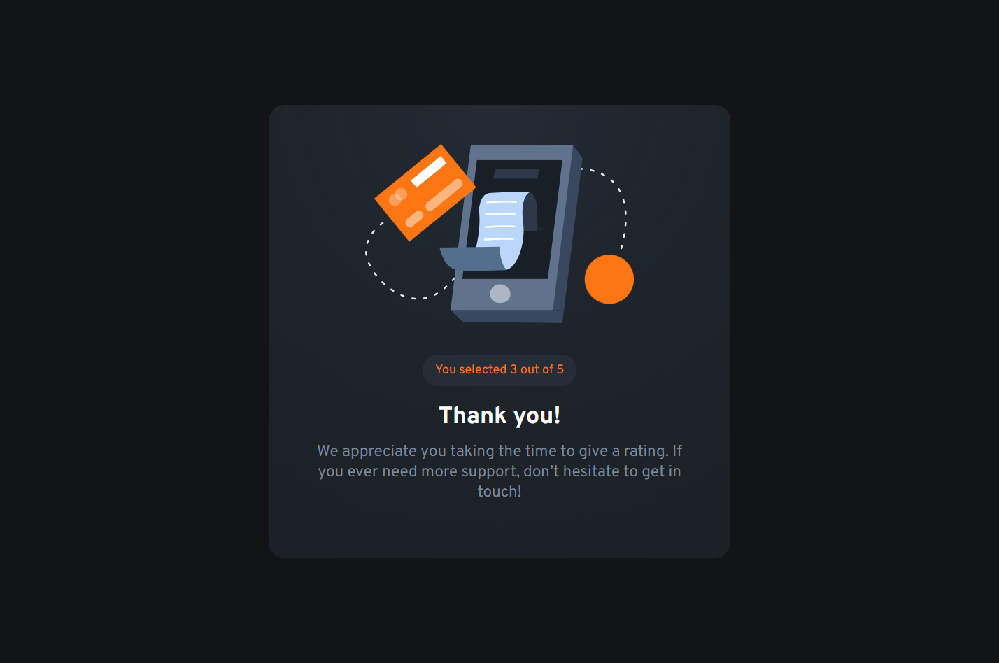
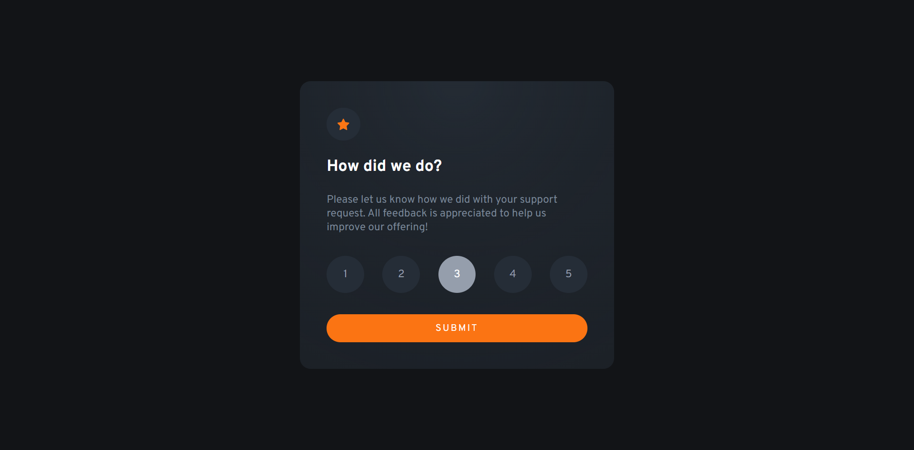

# Frontend Mentor - Interactive rating component solution

This is a solution to the [Interactive rating component challenge on Frontend Mentor](https://www.frontendmentor.io/challenges/interactive-rating-component-koxpeBUmI).

## Table of contents

- [Frontend Mentor - Interactive rating component solution](#frontend-mentor---interactive-rating-component-solution)
  - [Table of contents](#table-of-contents)
  - [Overview](#overview)
    - [The challenge](#the-challenge)
    - [Screenshot](#screenshot)
    - [Links](#links)
  - [My process](#my-process)
    - [Built with](#built-with)
  - [Author](#author)

## Overview

### The challenge

Users should be able to:

- View the optimal layout for the app depending on their device's screen size
- See hover states for all interactive elements on the page
- Select and submit a number rating
- See the "Thank you" card state after submitting a rating

### Screenshot

### Links

- Solution URL: [Click Here](https://www.frontendmentor.io/solutions/interactive-rating-page-eoPVvHA0DR)
- Live Site URL: [Click Here](https://karthikyerra1.github.io/interactive-rating/)

## My process

### Built with

- CSS custom properties
- Flex box
- Mobile-first workflow
- [React](https://reactjs.org/) - JS library
- [vie](https://vite.dev/) - Package Bundler

## Author

- Website - [KarthikYerra]
- Frontend Mentor - [@KarthikYerra1](https://www.frontendmentor.io/profile/KarthikYerra1)
